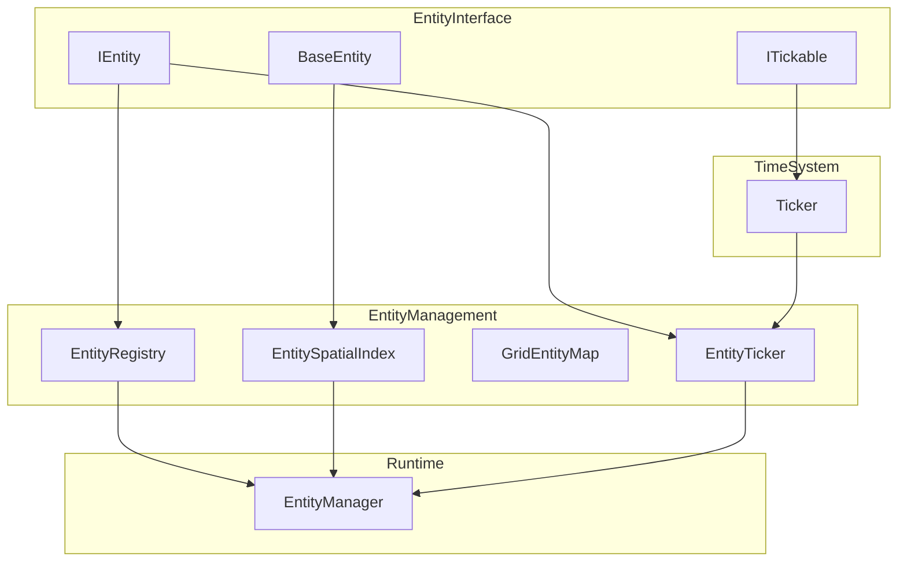

# Entity Component System (ECS)

The **ECS** in this project is a **modular, high-performance entity management framework** built for Unity.  
It’s designed to handle thousands of active game entities with **clean APIs**, **safe ticking**, and **efficient spatial lookups**.


##  Key Features


## ✨ Key Features

- **Modular Architecture:** Clear separation of responsibilities
- **Frame-Rate Independent Ticking:** Driven by the [`TimeSystem`](../TimeSystem/README.md)
- **Fast Spatial Queries:** Built on top of [`GridSystem`](../GridSystem/README.md)
- **Safe Runtime Changes:** Entities can be added/removed even during update cycles
- **Event-Driven Lifecycle:** Hooks for creation, activation, deactivation, and destruction

---

## 📁 Folder Overview

| Folder | Purpose | Docs |
|--------|---------|------|
| [`EntityInterface`](./EntityInterface/README.md) | Core contracts and base classes for all entities | [Docs](./EntityInterface/README.md) |
| [`EntityManagement`](./EntityManagement/README.md) | Systems for tracking, positioning, and ticking entities | [Docs](./EntityManagement/README.md) |
| [`Runtime`](./Runtime) | Entry-point `EntityManager` that combines all systems into one API | _(See below)_ |
| [`Editor`](./Editor) | Unity editor utilities for ECS tools | — |
| [`Tests`](./Tests) | Automated tests for ECS logic | — |

---

## 🏗️ Architecture Overview



<details>
<summary>Plain English Flow</summary>

* Entities implement `IEntity` (or extend `BaseEntity`).
* `EntityManager` registers entities into:
  * Registry for fast ID lookups
  * Spatial Index for location queries
  * Ticker for updates
* `Ticker` (from Time System) calls `Tick()` on all entities at a fixed interval.
* `GridEntityMap` stores and retrieves entities by their grid position.

</details>

---

## 🚀 Quick Start

**1. Create a Custom Entity**

```csharp
public class Enemy : BaseEntity
{
    public override void Tick()
    {
        // Movement or AI logic here
    }
}
```

**2. Set Up the Entity Manager**

```csharp
var ticker = FindAnyObjectByType<Ticker>();
var entityManager = new EntityManager(ticker, 100, 100);

var enemy = new Enemy();
entityManager.AddEntity(enemy, new Vector2Int(5, 5));
```

**3. Handle Ticks**

```csharp
// Called from MonoBehaviour Update()
entityManager.BeginTick();
ticker.UpdateTicks();
entityManager.EndTick();
```

---

## 🔗 Related Systems

- **Entity Interface:** Base contracts and entity definitions
- **Entity Management:** Core tracking, ticking, and spatial indexing
- **Time System:** Central heartbeat of the ECS
- **Grid System:** Spatial storage and queries for entities

---

## 📄 License

This ECS system is released under the MIT License.

---
